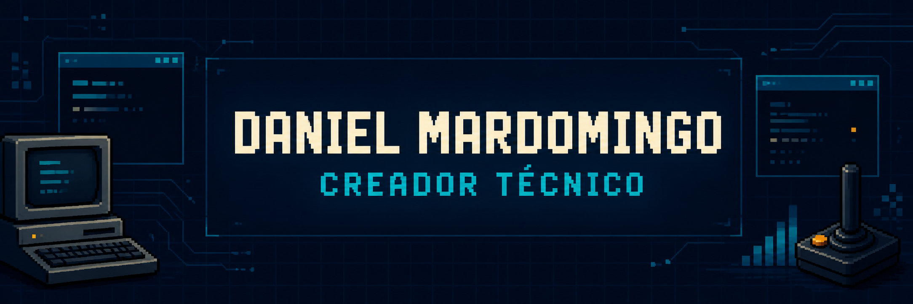
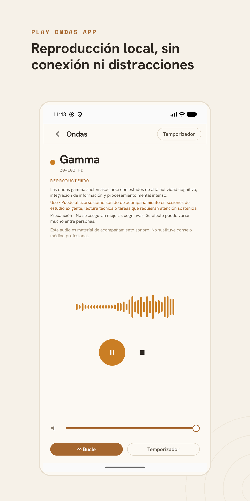

<div align="center">
  <a href="https://mardomingo.com">
    
  </a>
</div>

<p align="center">
  Construyo herramientas, aplicaciones y sistemas que conectan<br>
  <strong>inteligencia artificial, automatización, observabilidad y producto.</strong>
</p>

<p align="center">
  <a href="https://mardomingo.com/es"><strong>Web</strong></a> ·
  <a href="https://mardomingo.com/es/portfolio">Portfolio</a> ·
  <a href="https://mardomingo.com/es/blog">Blog</a> ·
  <a href="https://mardomingo.com/es/contact">Contacto</a> ·
  <a href="https://www.instagram.com/danimardo">Instagram</a>
</p>

## Hola, soy Daniel

Soy **creador técnico**. Convierto ideas y necesidades reales en productos
útiles, seguros y mantenibles, especialmente en la intersección entre agentes de
IA, automatización, observabilidad y aplicaciones de escritorio.

Me interesa construir sistemas que no se queden en una demostración: deben
resolver un problema concreto, poder diagnosticarse y estar documentados para
personas y agentes de IA.

<details>
<summary><strong>English</strong></summary>

I am a **technical creator** focused on turning real needs into useful, secure
and maintainable products—particularly at the intersection of AI agents,
automation, observability and desktop applications.

I build systems meant to operate beyond the demo: they solve concrete problems,
remain diagnosable and are documented for both people and AI agents.

</details>

## Proyectos destacados

| Proyecto | Qué resuelve | Tecnologías |
| --- | --- | --- |
| [**SmartDisk Monitor**](https://github.com/danimardo/smartdisk-monitor) | Vigila la salud de los discos en Windows —temperatura, SMART, actividad y alertas— en tiempo real y sin enviar nada a la nube por defecto. | Svelte 5 · Tauri 2 · Rust |
| [**MCP Log Gateway**](https://github.com/danimardo/mcp-openobserve) | Permite que agentes como Codex, Claude o Gemini consulten y correlacionen logs sin recibir credenciales maestras de OpenObserve. | TypeScript · MCP · Zod |
| [**Log Gateway API**](https://github.com/danimardo/api-openobserve) | Centraliza, valida, normaliza y protege el envío y consulta de logs de múltiples aplicaciones. | TypeScript · OpenObserve · Prometheus |
| [**Play Ondas**](https://github.com/danimardo/play-ondas-app) | Aplicación de escritorio offline con sonidos ambientales para concentración, relajación y descanso. | Svelte 5 · Tauri 2 · Rust |
| [**Secretario AI**](https://github.com/danimardo/secretario2) | Grabación, transcripción y transformación inteligente de voz para flujos profesionales. | Electron · Mistral AI · OpenRouter |
| [**MCP Coolify**](https://github.com/danimardo/mcp-coolify) | Expone la API de Coolify como herramientas MCP para operar infraestructura mediante lenguaje natural. | TypeScript · MCP · Coolify |

### Observabilidad preparada para agentes

```text
Agente IA
    │
    ▼
mcp-openobserve       acceso de solo lectura y herramientas de análisis
    │
    ▼
api-openobserve       autenticación, validación, redacción y rate limiting
    │
    ▼
OpenObserve           almacenamiento y consulta de logs
```

## En qué trabajo

- Herramientas para agentes de IA mediante **Model Context Protocol**.
- Logging y observabilidad con seguridad y privacidad por diseño.
- Aplicaciones de escritorio con **Svelte, Tauri, Rust y Electron**.
- Aplicaciones móviles multiplataforma.
- Automatización de infraestructura y operaciones.
- Productos técnicos centrados en utilidad y mantenibilidad.

## Tecnologías

`TypeScript` · `Svelte` · `SvelteKit` · `Node.js` · `Rust` · `Tauri` ·
`Electron` · `SQLite` · `Docker` · `OpenObserve` · `MCP` · `Playwright`

## Cómo trabajo

- Especificaciones antes de implementaciones relevantes.
- Seguridad y privacidad desde el diseño.
- Logging como contrato operacional observable.
- Pruebas unitarias, de integración y E2E con Playwright.
- Documentación viva y trazabilidad entre requisitos, código y validación.

## ¿Hablamos?

Si necesitas construir, modernizar o entender una solución técnica, puedes
conocer mejor mi trabajo en **[mardomingo.com](https://mardomingo.com/es)** o
encontrarme en **[Instagram](https://www.instagram.com/danimardo)**.

## Aplicaciones de escritorio, en imágenes

De los proyectos de arriba, estos tres tienen interfaz propia. Cada captura es la que ya vive en
su propio repositorio.

### [SmartDisk Monitor](https://github.com/danimardo/smartdisk-monitor)

Supervisión local de la salud de los discos en Windows: temperatura, SMART, actividad y alertas
correlacionadas con el registro de eventos de Windows, sin enviar nada a la nube por defecto.
Incluye benchmark de rendimiento, informes exportables y comprobación opcional de actualizaciones
firmadas.


### [Play Ondas](https://github.com/danimardo/play-ondas-app)

Reproductor de escritorio de ondas cerebrales y sonidos ambientales para concentración, relajación
y descanso. Los audios se descargan una vez, en el primer arranque, y desde entonces funciona
completamente sin red.


### [Secretario AI](https://github.com/danimardo/secretario2)

Grabación de voz y transcripción automática con IA para profesionales: dicta notas, correos o
mensajes y los convierte al instante en texto redactado, con dictado global desde segundo plano y
mejora de estilo mediante LLM.


### [Play Ondas app 2.0](https://github.com/danimardo/play-ondas-app-2.0) *(repositorio privado)*

Reescritura completa de Play Ondas en Kotlin Multiplatform + Compose Multiplatform: misma
interfaz para Android, iOS y Windows. Diez ondas cerebrales y ruidos ambientales en bucle, audio
personalizable por categoría, temporizador de apagado con fundido y reproducción en segundo plano,
funcionando sin conexión salvo para la descarga inicial de los sonidos.


